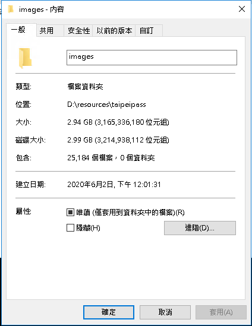
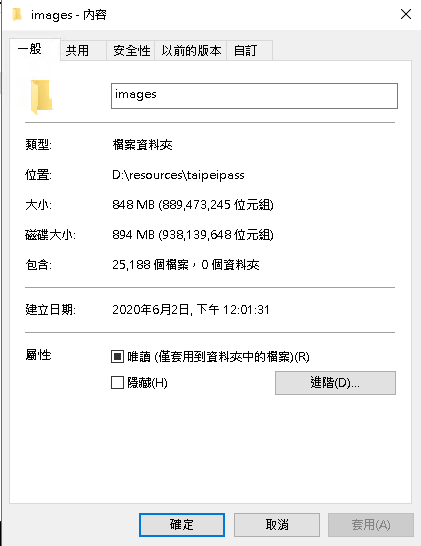

# SquooshImgCompression

此工具是用來壓縮大量圖片，支持jpeg和png格式，內有使用[Squoosh]的api。

Squoosh可以有效的減少圖片大小，還能維持畫質，可至[官網]實測結果。

node.js僅能使用v17以下版本

## 使用方法

1. 下載node packages
```
npm install
```
2. 將要壓縮的圖片放在同一個資料夾裡，以下指令開始壓縮（路徑必須使用「/」，例：D:/squooshimgcompression/images）
```
npm start {要壓縮的檔案路徑}
```
3. 跑完後會出現`newimages`資料夾，裡面就是壓縮完的圖片，圖片名稱會和壓縮前的名稱一樣

4. 如果跑到一半失敗，`newimages`已存在部份成功壓縮的圖片，當重新執行程式時，會比對`newimages`資料夾內的圖片名稱，如果名稱重複就不壓縮

## log訊息解釋

  * [ {`圖片名`} ] Write operation complete.{`數量`} : 壓縮成功
  * [ {`圖片名`} ] oldSize < newSize{`數量`} : 成功壓縮但新圖檔比舊圖檔大，所以原圖複製存入newimages資料夾
  * [ {`圖片名`} ] not jpeg or png. : 非圖片格式，壓縮失敗

## 執行案例

原檔案數:25184  
* 成功壓縮23124個檔案  
* 執行時間58分  
* 2.99GB -> 894MB




[squoosh]: https://github.com/GoogleChromeLabs/squoosh
[官網]: https://squoosh.app/
